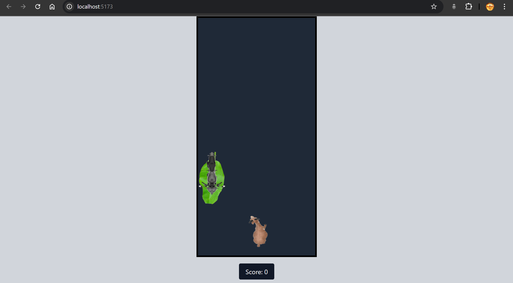

# Goat Game

A simple game where you control a goat, avoid obstacles, and collect items. The game is built using **React**, **Vite**, and **Tailwind CSS**.


## Features
- Move the goat left and right to collect leaves and avoid bikes.
- Score system based on collecting leaves.
- Game ends when the goat hits a bike.

## Screenshots


## Installation
To run this project locally, follow these steps:

1. **Clone the repository:**
   ```bash
   git clone https://github.com/SivaPhoenix/goat-game.git
   cd goat-game
   ```

2. **Install dependencies: Make sure you have Node.js installed. Then run:**
   ```bash
   npm install
   ```

3. **Start the development server**
   ```bash
   npm run dev
   ```

